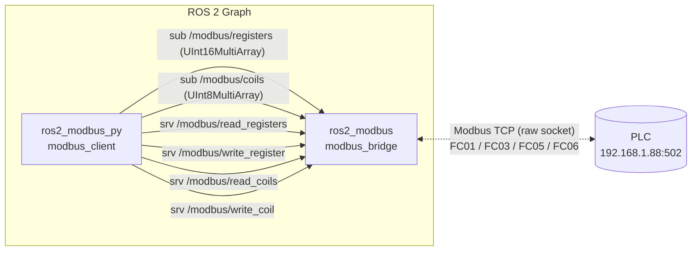
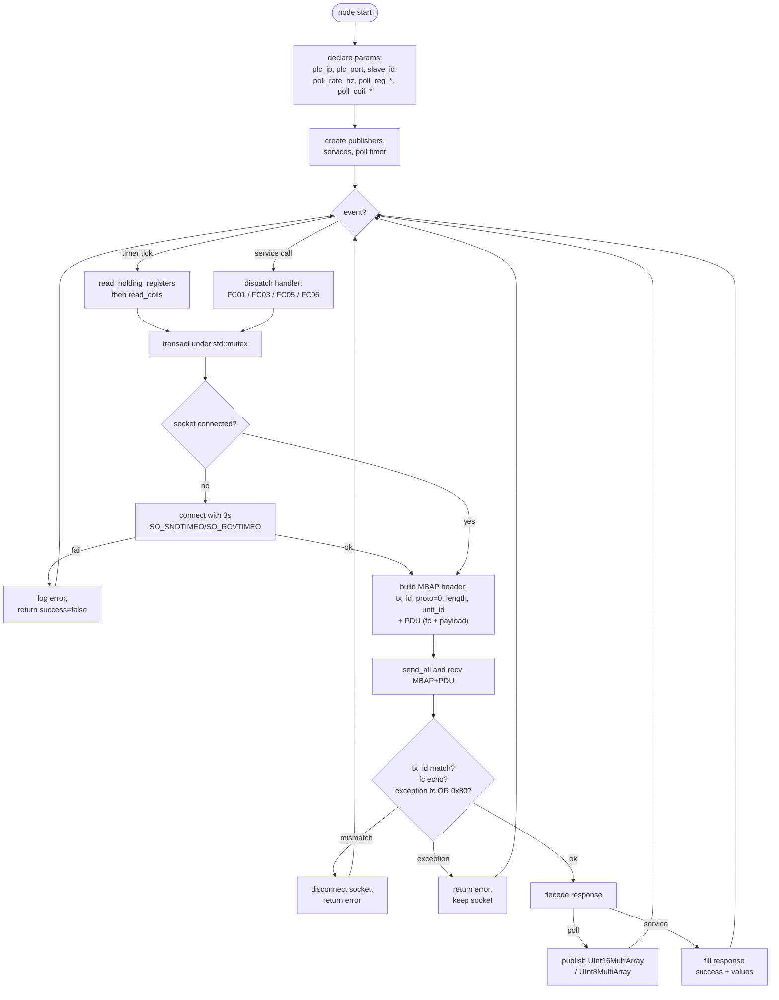

# ros2_modbus — ROS 2 Modbus TCP Bridge

A pair of ROS 2 packages that expose a Modbus TCP PLC to the ROS 2 graph as
topics and services. The transport is implemented directly on top of POSIX
sockets — **no libmodbus, pymodbus, or any other Modbus library is used**.

| Package          | Lang   | Build type     | What it does                                                      |
| ---------------- | ------ | -------------- | ----------------------------------------------------------------- |
| `ros2_modbus`    | C++17  | `ament_cmake`  | The bridge node + `.srv` definitions. Talks Modbus TCP to the PLC. |
| `ros2_modbus_py` | Python | `ament_python` | A demo client that subscribes to the topics and calls the services. |

---

## Architecture



### Bridge internal flow



---

## Topics

| Topic                  | Type                         | Direction | Notes                                      |
| ---------------------- | ---------------------------- | --------- | ------------------------------------------ |
| `/modbus/registers`    | `std_msgs/UInt16MultiArray`  | bridge → | Published every poll tick (FC03).          |
| `/modbus/coils`        | `std_msgs/UInt8MultiArray`   | bridge → | One byte per coil (0/1). Published every poll tick (FC01). |

> The original spec asked for `std_msgs/BoolMultiArray`, but no such type
> exists in `std_msgs`. `UInt8MultiArray` is the standard substitute.

## Services

| Service                  | Type                        | Function code |
| ------------------------ | --------------------------- | ------------- |
| `/modbus/read_registers` | `ros2_modbus/ReadRegisters` | FC 03 — Read Holding Registers |
| `/modbus/write_register` | `ros2_modbus/WriteRegister` | FC 06 — Write Single Register  |
| `/modbus/read_coils`     | `ros2_modbus/ReadCoils`     | FC 01 — Read Coils             |
| `/modbus/write_coil`     | `ros2_modbus/WriteCoil`     | FC 05 — Write Single Coil (0xFF00 / 0x0000) |

All services return `bool success` + `string message` and, for reads, the
decoded values.

## Parameters (bridge node)

| Name                 | Type    | Default         |
| -------------------- | ------- | --------------- |
| `plc_ip`             | string  | `192.168.1.88`  |
| `plc_port`           | int     | `502`           |
| `slave_id`           | int     | `0`             |
| `poll_rate_hz`       | double  | `1.0`           |
| `poll_reg_address`   | int     | `0`             |
| `poll_reg_count`     | int     | `10`            |
| `poll_coil_address`  | int     | `0`             |
| `poll_coil_count`    | int     | `8`             |

---

## Layout

```
ros2_ws/
└── src/
    ├── ros2_modbus/               # C++ bridge + srv definitions
    │   ├── CMakeLists.txt
    │   ├── package.xml
    │   ├── srv/{ReadRegisters,WriteRegister,ReadCoils,WriteCoil}.srv
    │   ├── include/ros2_modbus/modbus_bridge.hpp
    │   └── src/modbus_bridge.cpp
    └── ros2_modbus_py/            # Python demo client
        ├── package.xml
        ├── setup.py / setup.cfg
        ├── resource/ros2_modbus_py
        └── ros2_modbus_py/modbus_client.py
```

---

## Build (WSL, Ubuntu + ROS 2)

All commands run **inside WSL**. From a Windows shell, prefix with
`wsl bash -c "..."`; from a WSL shell, run them directly.

```bash
# Enter WSL first if you're on PowerShell/cmd:
#   wsl

cd /mnt/c/Users/gnith/Merlin/plc/plc_ws/ros2_ws
source /opt/ros/humble/setup.bash     # or /opt/ros/rolling/setup.bash

colcon build --packages-select ros2_modbus ros2_modbus_py --symlink-install
```

## Run

Terminal 1 — the bridge:

```bash
source install/setup.bash
ros2 run ros2_modbus modbus_bridge
# or with overrides:
ros2 run ros2_modbus modbus_bridge --ros-args \
    -p plc_ip:=192.168.1.88 -p plc_port:=502 \
    -p poll_rate_hz:=2.0 -p poll_reg_count:=20
```

Terminal 2 — the demo Python client (subscribes + calls each service once):

```bash
source install/setup.bash
ros2 run ros2_modbus_py modbus_client
```

## Quick CLI examples

```bash
# Read 10 holding registers starting at 0
ros2 service call /modbus/read_registers \
    ros2_modbus/srv/ReadRegisters "{address: 0, count: 10}"

# Write 1234 to register 0
ros2 service call /modbus/write_register \
    ros2_modbus/srv/WriteRegister "{address: 0, value: 1234}"

# Read 8 coils starting at 0
ros2 service call /modbus/read_coils \
    ros2_modbus/srv/ReadCoils "{address: 0, count: 8}"

# Turn coil 0 on
ros2 service call /modbus/write_coil \
    ros2_modbus/srv/WriteCoil "{address: 0, value: true}"

# Watch the poll topics
ros2 topic echo /modbus/registers
ros2 topic echo /modbus/coils
```

---

## Implementation notes

- **MBAP header** is 7 bytes: `tx_id(2) | proto_id=0 (2) | length(2) | unit_id(1)`.
  `length = 1 + len(PDU)` (unit_id + PDU).
- **Transaction ID** increments per request and wraps at `uint16` max.
  Every response must echo it; a mismatch drops the socket.
- **Exception responses** (`fc | 0x80`) are surfaced as
  `success=false` + `message="modbus exception fc=… code=…"` while the
  TCP connection is kept open.
- **Timeouts** are enforced via `SO_SNDTIMEO` and `SO_RCVTIMEO` (3 s each).
- **Thread safety**: every socket I/O path goes through `transact()` under
  a `std::mutex`, so poll-timer and service callbacks serialize cleanly.
- **Auto-reconnect**: any socket-level failure closes the fd; the next
  `transact()` reopens it. No crash, no backoff loop.
